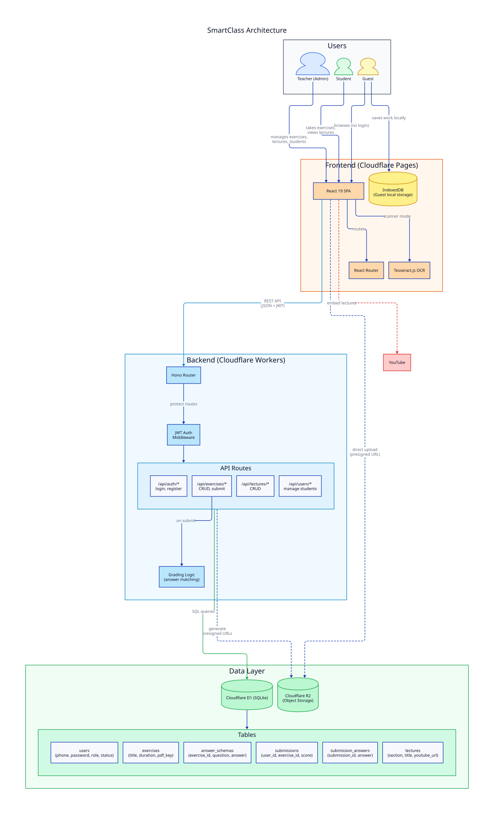

# SmartClass

An assessment platform for teaching and learning, built on Cloudflare.



## Features

- **Teacher (admin)**: upload exercises (PDF) with answer schemas, manage lectures, create/approve student accounts
- **Student**: take timed or untimed exercises, submit answers (manual form, scanner/OCR, image upload), get auto-graded, review past results, watch lecture videos
- **Guest**: browse exercises and lectures, submit exercises with results saved locally — no login required

<details>

<summary><h2>Roadmap</h2></summary>

Each milestone produces a usable, deployable version.
Completed milestones and shipped changes are recorded in [`CHANGELOG.md`](CHANGELOG.md).

### v0.5 — Lectures

- [ ] Plan guest mode: design IndexedDB storage, guest route access, and data model for anonymous exercise completion (implementation in v0.6)
- [ ] Student: browse and watch lecture videos

> **Ship:** full learning experience with exercises + video lectures.

### v0.6 — Guest mode & polish

- [ ] Guest access: no login, browse exercises/lectures, submit with results saved in IndexedDB
- [ ] Prompt guest to register after engagement
- [ ] UI polish and mobile responsiveness

> **Ship:** anonymous users can try the platform — ready for marketing.

### Queueing

- [ ] Each answer includes an explanation field (image/markdown with math notation supported) created when uploading exercises
- [ ] Auth: forget password
- [ ] Auth: change password (teacher and student, teacher can reset student passwords)
- [ ] LLM prompt for extraction
- [ ] Additional user fields: name, class/grade, other social media links, profile image, email
- [ ] Teacher: view student list with stats (exercises taken, average score, last active)
- [ ] Teacher: view individual student profiles with submission history and performance trends
- [ ] Auth: connect with google acconts for easier login and account recovery
- [ ] Idea: students can submit an offline exercise by scanning a QR code on the exercise sheet, which opens a submission form pre-filled with the exercise ID and student info (if logged in) — this allows for easy offline-to-online transition without manual input of exercise details.
  - [ ] Generate QR code for each exercise
- [ ] Buy domain and set things up
- [ ] Cost analysis and estimation dashboard
- [ ] Structure logging system for best debugging and monitoring in production

</details>

## Tech Stack

| Layer    | Technology                                                  |
| -------- | ----------------------------------------------------------- |
| Frontend | React 19, Vite 6, shadcn/ui + Tailwind CSS v4, React Router |
| Backend  | Cloudflare Workers + Hono                                   |
| Database | Cloudflare D1 (SQLite)                                      |
| Storage  | Cloudflare R2 (PDFs, images)                                |
| Vision   | Grok 4.1 Fast via OpenRouter (Gemini 2.5 Flash fallback)    |
| Auth     | Phone (+84xxx) + password, JWT                              |

## Project Structure

```
smartclass/
├── src/                    # Frontend (React)
│   ├── main.jsx            # App entry
│   ├── router.jsx          # Router entry
│   ├── pages/              # Route pages
│   ├── lib/                # API client + auth state
│   └── test/               # Test setup
├── worker/                 # Backend API
│   ├── index.js            # Hono app entry
│   ├── routes/             # Route handlers
│   ├── middleware/         # JWT auth
│   ├── lib/                # Auth helpers
│   └── db/                 # D1 migrations + seeds
├── .github/workflows/      # CI/CD workflows
├── docs/                   # Documentation
│   └── plans/              # Design docs
├── wrangler.toml           # Cloudflare worker config
└── package.json
```

## Getting Started

```bash
npm install
npm run dev       # Start dev server at localhost:5173
npm run dev:api   # Start Cloudflare Worker locally at localhost:8787
npm run build     # Production build
npm run preview   # Preview production build
```

<details>
<summary><h3>Environment Variables (`.envrc`)</h3></summary>

```bash
export APP_ENV=development
export JWT_SECRET=replace-with-a-long-random-string
export JWT_EXPIRES_IN=7d
export CLOUDFLARE_ACCOUNT_ID=your_account_id
export CLOUDFLARE_D1_DATABASE_ID=your_d1_database_id
export CLOUDFLARE_D1_DATABASE_NAME=smartclass
export CLOUDFLARE_R2_BUCKET_NAME=smartclass-assets
export APP_CORS_ORIGIN=http://localhost:5173
export VITE_API_BASE_URL=http://localhost:8787
export OPENROUTER_API_KEY=your_openrouter_api_key
export OPENROUTER_MODEL=google/gemini-2.5-flash
```

For local Worker secrets during `wrangler dev`, create `.dev.vars`:

```bash
JWT_SECRET=replace-with-a-long-random-string
JWT_EXPIRES_IN=7d
OPENROUTER_API_KEY=your_openrouter_api_key
```

Cloudflare resources can be created from CLI:

```bash
npx wrangler login
npx wrangler d1 create smartclass
npx wrangler r2 bucket create smartclass-assets
npx wrangler secret put JWT_SECRET
```

After creating resources, update `wrangler.toml` with your real D1 `database_id`.

</details>

<details>
<summary><h3>Database Setup (D1)</h3></summary>

```bash
# Apply schema
npx wrangler d1 execute smartclass --local --file worker/db/migrations/0001_init.sql
npx wrangler d1 execute smartclass --remote --file worker/db/migrations/0001_init.sql

# Seed bootstrap teacher

npx wrangler d1 execute smartclass --local --file worker/db/seeds/0001_seed_teacher.sql
npx wrangler d1 execute smartclass --remote --file worker/db/seeds/0001_seed_teacher.sql

```

If your database name is not `smartclass`, replace it in the commands above.

The teacher seed is idempotent and can be re-run safely.

</details>

<details>
<summary><h3>Deployment</h3></summary>

Production domains:

- Backend: https://api.smartclass.lelouvincx.com
- Frontend: https://smartclass.lelouvincx.com
- Dbdocs: https://dbdocs.io/lelouvincx/smartclass

Setup summary:

1. Cloudflare Pages project `smartclass` via GitHub App:
2. Worker route: `api.smartclass.lelouvincx.com`
3. GitHub repository secrets:
   - `CLOUDFLARE_API_TOKEN`
   - `CLOUDFLARE_ACCOUNT_ID`
   - `JWT_SECRET`
   - `DBDOCS_TOKEN`

Repository automation:

- `.github/workflows/deploy-worker.yml`: deploys Worker on `main` after install/test/build
- Manual deploy commands:
  - `npm run deploy:api`
  - `npm run deploy:web`

#### Post-deploy smoke checks

```bash
curl -s https://api.smartclass.lelouvincx.com/api/health
```

Then verify browser login flow at `https://smartclass.lelouvincx.com`.

</details>

<details>
<summary><h3>GitHub Releases</h3></summary>

Tags matching `v*` trigger `.github/workflows/release.yml`, which runs test/build checks and then creates a GitHub Release with autogenerated notes.

Create a new release tag:

```bash
git checkout main
git pull
git tag -a v0.1.0 -m "v0.1.0"
git push origin v0.1.0
```

</details>
